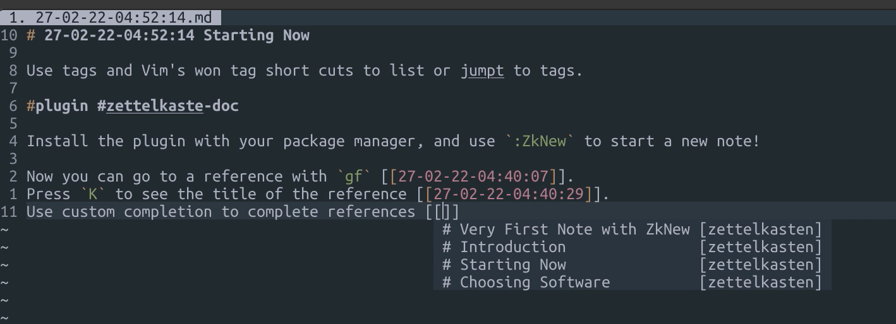

# zettelkasten.nvim

`zettelkasten.nvim` is a Vim philosophy oriented [Zettelkasten](https://zettelkasten.de) note
taking plugin.

Using this plugin, you can:

1. Create new notes with unique IDs (`:help :ZkNew`)

2. List the places where a tag is used with `:tselect tag_name` or use Vim's own tag shortcuts for
   navigation.

3. Use `i_CTRL-X_CTRL-]` to get a list of all the tags in your notes.

4. Get a completion list of note references.

5. Use `K` command to display context for a note ID.

6. Use `gf` to navigate to a reference. As long as your `:help path` option is set correctly, this
   will work.

There's no separate file type for zettelkasten. Markdown file type is used to extend the
functionality to make it easier to take notes.

# Demo

Click the image for a demo.

# Installation

Install using your favorite plugin manager. There's no required dependencies.

# Configuration

See `:help zettelkasten.txt` for more information.
